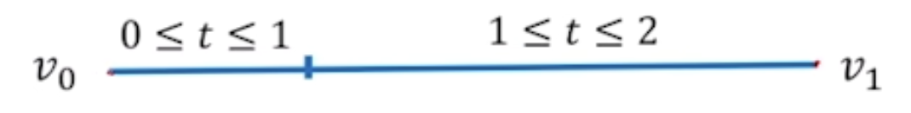

# 三次样条函数
## 力学解释
三次样条的形状最开始是通过力学方程来表示的，即伯努利-欧拉方程。
> 伯努利-欧拉方程  
> $M\(x\) = EIK\(k\)=EI\frac{y^{''}(x)}{(1+(y^{'}(x)^2))^{\frac{3}{2}}}$

其中 $EI$ 都是跟样条本身的材质有关，与变量 $x$ 无关，因此可以看成常数，而当样条不受力的时候， $M(x)=0$ ，因此可以得到  

但是很明显这个方程由于 $k(x)$ 是非线性的，并不方便通过矩阵的方式做线性变换，因此需要做出一个**小扰动假设**。
> 小扰动假设：当弯折角度不大于 $45^\circ$ 时
> 因为 $y^{'} \ll 1$  
> $\(1+(y^{'}(x))^2\)^\frac{3}{2} \approx 1$   
> $M(x)=EIy^{''}(x)$  
同时，如果加入小扰动假设，那么弯矩的表达式会变成一个一次式（推导过程不必深究） 
> $M(x)=ax+b$  
那么联立上述两个加入**小扰动假设**的式子，可以发现 $y(x)$ 是一个三次式。  
> $EIy^{''}(x)=ax+b$  
> $y(x)=a_0 + a_1x + a_2x^2 + a_3x_3$  

所以每两个控制点之间的曲线**可以**被**三次函数**表示。 

因为我们要求每一段样条被**三次函数**表示，所以会要求其 $\boldsymbol{C^2}$ 连续，此外，要求其 $\boldsymbol{C^2}$ 连续还有一个原因是为了解方程，对于 $n+1$ 个控制点，共需要 $n$ 个三次式，则一共有 $4n$ 个未知数，也就是说要有 $4n$ 个等式才能求解。  

对于 $n+1$ 个控制点，去掉首位 $2$ 个点，有 $n-1$ 点，而这 $n-1$ 个点都被要求了 $C^2$ 连续，所以可以写出 $3n-3$ 个等式  
> 每一个点可以列出三个等式，比如  
> $y_0(x_1)=y_1(x_1)$  
> $y_0^{'}(x_1)=y_1^{'}(x_1)$   
> $y_0^{''}(x_1)=y_1^{''}(x_1)$  
> $\cdots \cdots$  
> 其中y的下标表示了这是第0段和第1段样条的表达式  
此外还可以通过 $n+1$ 个控制点再写出 $n+1$ 个式子，此时一共 $4n-2$ 个式子，还缺2个式子。  
> $y_0(x_0)=y_0, y_0(x_1)=y_1,\cdots$  
> 此处字母发生了混用，等式右侧的 $y_i$ 表示了样条在二位平面的纵坐标的值。  

回想一下我们因为什么而缺少了2个等式——是因为我们在列每个点满足 $C^2$ 连续的等式的时候，没有考虑开头和结尾2个点，因此需要给这两个点在连续性上找2个等式。  

这里可以用2种方法来补充这少的2个式子：  
+ Hermite型插值多项式  
+ Lidstone型插值多项式  

> 这里以Hermite型为例，对于端点，比如说起始点 $x_0$ ，我们可以求出其右导数，而又已知起始点所在的曲线是一个三次函数曲线，则要求4个未知量，但是我们又知道这4个条件： $x_0$ 的右导数， $x_0$ 的位置与对应的 $y_0$ , $x_1$ 的导数， $x_1$ 的位置与对应的 $y_1$ ,那么这样就有了4个等式，自然就可以求4个未知量了。

---
## 数学推导
### 函数条件
对于三次样条函数 $S(x) \in C^2\[a,b\]$ ，其中 $a=x_0, x_1, \cdots, x_n=b$ ，若对于 $x_i$ 有 $y_i=f(x_i)$ ，且：  
 $$S(x_i)=y_i$$  
 则 $S(x_i)$ 对于每一对坐标 $(x_i, y_i)$ 满足：  

 $$S(x_i-0)=S(x_i+0)$$  
 $$S^{'}(x_i-0)=S^{'}(x_i+0)$$  
 $$S^{''}(x_i-0)=S^{''}(x_i+0)$$  

通过这种方法能够构建除了 $a,b$ 外所有点的相应的关系式，再加上 $S(x_i)=y_i$ ，共有 $4n-2$ 个条件，如上文所说，还要在两端点处寻找2个条件，一般有3种方法
+ Hermite型插值多项式
> Hermite型插值多项式的定义比较复杂，简单来说就是通过考虑函数的1阶导数来构造插值函数，在这里就是分别考开始点 $x_0$ 和结束点 $x_n$ 的1阶右导数和左导数，因此：
> $$S^{'}(x_0)=f_{+}^{'}(x_0), S^{'}(x_n)=f_{-}^{'}(x_n)$$  

+ Lidstone型插值多项式  
> Lidstone型插值多项式是对于Lagrange插值多项式的改进，因此其插值多项式是n阶可倒的，也因此可以利用该插值多项式构造此处的二阶导数条件，即：  

> $$S^{''}(x_0)=f_{+}^{'}(x_0), S^{'}(x_n)=f_{-}^{''}(x_n)$$  
> 其中 $S^{'}(x_0)=S^{'}(x_n)=0$ 被称为**自然边界条件**  

+ 当 $f(x)$ 是一个周期函数时  
> 当 $f(x)$ 是一个周期函数时，那么 $S(x)$ 也是周期函数，此时边界条件就会满足：  

> $$S(x_0+0)=S(x_n-0),$$  
> $$S^{'}(x_0+0)=S^{'}(x_n-0),$$  
> $$S^{''}(x_0+0)=S^{''}(x_n-0),$$  

### 三弯矩方程
如上文所讲，当考虑*小扰动假设*的时候，样条的弯矩的二阶导数是一个线性方程，也就是说弯矩可以被写为： 

 $$S_i^{''}(x)=\frac{M_i}{x_{i+1}-x_i}(x_{i+1}-x)+\frac{M_{i+1}}{x_{i+1}-x_i}(x-x_i) \tag{1}$$  

然后如果设 $h_i=x_{i+1}-x_i$ 的话，可以将公式简写为：  

 $$S_i^{''}(x)=\frac{M_i}{h_i}(x_{i+1}-x)+\frac{M_{i+1}}{h_i}(x-x_i) \tag{2}$$  

 通过2次积分可以获得：  

 $$S_i(x)=\frac{M_i}{6h_i}(x_{i+1}-x)^3+\frac{M_{i+1}}{6h_i}(x-x_i)^3+C(x-x_i)+D(x_{i+1}-x) \tag{3}$$   

 现在公式中一共有4个未知量： $M_i,M_{i+1},C,D$ ，虽然理论上按照上面函数条件的构想可以列出 $4n$ 个等式并求解，但这并不够高效，当我们直接带入 $S(x_i)=y_i,S(x_{i+1})=y_{i+1}$ 这两个条件到上述方程中，可以直接消除C和D这两个未知量：  

 $$S_i(x)=\frac{M_i}{6h_i}(x_{i+1}-x)^3+\frac{M_{i+1}}{6h_i}(x-x_i)^3+(\frac{y_{i+1}}{h_i}-\frac{M_{i+1}h_i}{6})(x-x_i)+(\frac{y_i}{h_i}-\frac{M_{i}h_i}{6})(x_{i+1}-x) \tag{4}$$  

上面这个式子 $(4)$ 便是**三弯矩方程**，接着我们继续**优化**计算过程，即然**三次样条函数**是 $C^2$ 连续的，则对于 $i=0,1,\cdots,n-2$ (共有n+1个点)，都有 $S_{i-1}^{'}(x_i)=S_i^{'}(x_i)$ ，但这样只有 $n-1$ 个条件式，而对于每一个样条的弯矩 $M_0,M_1,\cdots,M_n$ 共有 $n+1$ 个未知量要求，但这个时候我们只需要利用上面所提的**自然边界条件**，令 $M_0=M_n=0$ ，那么现在就只剩下 $n-1$ 个未知量了，然后可以列出矩阵。  

$$\begin{bmatrix} u_1 & h_1 &  &  &  &   \\\\ h_1 & u_2 & h_2 &  &  &  \\\\  & h_2 & u_3 & h_3 &  &  \\\\  &  & \cdots & \cdots & \cdots &  \\\\  &  &  & h_{n-3} & u_{n-2} & h_{n-2} \\\\  &  &  &  & h_{n-2} & u_{n-2} \\\\ \end{bmatrix}\begin{bmatrix} M_1\\\\ M_2\\\\ M_3\\\\ \cdots\\\\ M_{n-2}\\\\ M_{n-1}\\\\ \end{bmatrix} = \begin{bmatrix} v_1\\ v_2\\\\ v_3\\\\ \cdots\\\\ v_{n-2}\\\\ v_{n-1}\\\\ \end{bmatrix}$$  

其中，

 $$h_i=x_{i+1}-x_i$$  
 $$u_i=2(h_{i+1}-h_i)$$  
 $$b_i=\frac{6}{h_i}(y_{i+1}-y_i)$$
 $$v_i=b_i-b_{i-1}$$

---
## 几何连续( $G^n$ )  

上述一直在讨论的$C^n$连续许多并不实用，比如说这样一张图： 

  

很明显这是一条直线，那么直线一定是任意阶连续的，但如果我们对其进行如图中所示进行参数化，那么在分段点的位置（ $t=1$ ），他是 $C^1$ 不连续的！这在数学上是对的，但是在工程实践中是反直觉的，因此需要定义一种连续性，或者需要一种方法，使得我们能够所见即所得，让这条直线**变得**任意阶连续，这就是几何连续的由来。  

**几何连续**:假设 $\phi (t)(a\le t \le b)$ 是给定曲线，若存在一个参数变换 $t=\rho (s)(a_1 \le s \le b_1)$ ，使得 $\phi (\rho (s)) \in C^n\[a_1,b_1\]$ ，且 $\frac{d\phi(\rho(s))}{ds} \ne 0$ ，则称曲线 $\phi(t)(a \le t \le b)$ 为n阶几何连续曲线，记作:  
$$\phi(t) \in G^n\[a,b\]$$  

这里条件 $\frac{d\phi(\rho(s))}{ds} \ne 0$ 是为了保证曲线上无奇点，换句话说就是曲线是参数化的，再换一句话说就是想象曲线上有一个动点，一般的参数化曲线都代表了这个点的运动轨迹，如果1阶导数为0，那么这个点就不动了，曲线就画不出来了。  

必须一提的是，**几何连续**是曲线本身的**固有属性**,是与参数选取无关的，就像是常温常压下密度之于水一样，不管水的体积是多少，密度永远不变。