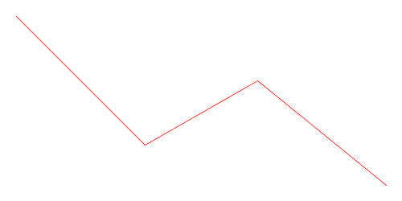
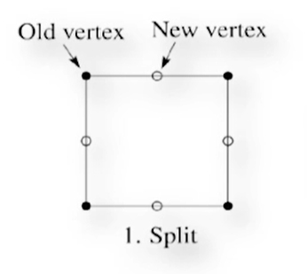
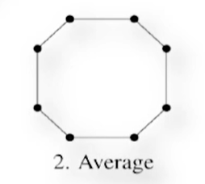
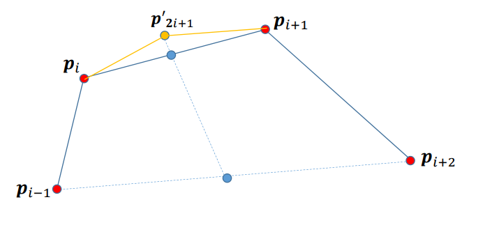
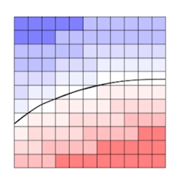

## NURBS曲线
### 有理Beizier曲线
Beizier曲线本质上是用多项式去拟合曲线，但是无法完美拟合一个圆弧，原因可以用圆弧的曲率解释：

圆弧的曲率是一个固定的值，即：

$$\kappa=\frac{1}{R}$$

然而想要使用Beizier曲线拟合的话，Beizier曲线的曲率可以写为：

$$\kappa=\langle N(t),\frac{d\gamma^2 (t)}{dt^2}\rangle$$

其中 $N(t)$ 为单位曲线法线方向，显然，Beizier曲线不可能仅用3个控制点就被画出，也就是说使用Beizier曲线去近似一个圆弧，那么Beizier曲线的多项式次数一定大于2，因此曲率大小会不停变化，所以无法完美拟合圆弧，但是工程上圆弧的使用却是十分广泛的，因此就有了**有理Beizier曲线**：

$$f^{(eucl)}(t)=\sum_{i=0}^{n}{\boldsymbol{p_i}\frac{{B_i(t)\omega_i}}{\sum_{i=0}^{n}{B_i(t)\omega_i}}}$$

实际上就是给了每一个控制顶点一个权重 $\omega_i$ ，通过这个 $\omega_i$ 来赋予原先Beizier曲线做不到的事情——比如说拟合圆弧，然而更加形象的解释是这个方法实际上是利用了齐次坐标的思想，即：

$$f(t)=\begin{pmatrix}1 & t & \cdots & t^n & 1\end{pmatrix}\begin{pmatrix}B_0(t) & \cdots & B_n(t) & \Omega \end{pmatrix}\begin{pmatrix}p_0 \\\\ \vdots \\\\ p_n \\\\ 1\end{pmatrix}$$

其中 $B_i(t)$ 都是列向量，且有

$$\Omega=\begin{pmatrix}0 \\\\ \vdots \\\\ 0 \\\\ 1 \end{pmatrix}$$

中间的矩阵组成了曲线的基矩阵。

而用齐次坐标表示的点最后都要经历齐次除法，几何上的解释就是齐次坐标实际上是一条曲线在高维上的表示，在经历齐次除法后，就是将原先高维的曲线在它本来所在的维度沿齐次坐标所在轴进行了等比缩放，而后在齐次坐标平面进行投影的结果，因此即便有理Beizier曲线在高维依旧无法表示圆弧，但是经过投影过后的曲线却是可以的。

### NURBS曲线
NURBS曲线全称是Non-Uniform Rational B-Spline curves，也就是非均匀有理B样条曲线，这个名称只要拆看看就好理解。

首先是**有理B样条**，有理的意思其实和上面的有理Beizier曲线一样，即也是通过增加一个权重来实现原先B样条无法达到的一些控制效果。

齐次是**非均匀**，非均匀的意思就是结点向量的选取非均匀，在上一章节的Uniform B-Spline中，所有结点向量的间隔都是 $1$ ，然而这样的选取显然存在不合理性，而采用**非均匀**能够更好的表示控制点之间的关系。

NURBS曲线的表达式为：

$$f(t)=\sum_{i=0}^{n}{\boldsymbol{p_i}\frac{{N_i(t)\omega_i}}{\sum_{i=0}^{n}N_i(t)\omega_i}}$$

## 细分曲线
除了通过直接的参数化方法拟合曲线外，还有别的绘制曲线的思路：

1. 想象最开始人类是如何计算 $\pi$ 的——**割圆法**，细分曲线也是利用了化曲为直的思想来进行近似的。首先也是需要一些控制点，这些控制点之间依次连接能够构成一个折线段，通过不断在原先的折线段上割去一些“锐利的”角，来让这条曲线变得没有那么“锐利”，不断重复这个过程，好似在打磨一根折线最后变得“圆润”的过程，最后使其变为光滑的曲线，而这就是**Chaikin细分法**和**均匀三次B样条曲线细分法**的思想。

2. 前面一种是想着如何“打磨”直线让其变为曲线，这一种方法的想法是把控制点之间构成的初始的折现想象成一根不易弯折的钢丝，我们需要不断的去敲打锻造这根钢丝，让其能够“拱起来”形成曲线，这就是**插值细分法**的思想。

### Chaikin细分法
Chaikin细分法主要定义了如何去“打磨”一根折线段，具体实现是分为两个步骤：

1. 分割：在两个控制点之间 $\frac{1}{2}$ 的位置生成两个待分割的位置，并加入点集之中。

2. 裁剪：对于每个点，将其位置与顺时针相邻的一个的位置计算平均，并生成新的点

### 均匀三次B样条曲线细分方法

和Chaikin细分法类似，也是分为分割与裁剪两个阶段：

1. 分割：同样是在两个控制点之间 $\frac{1}{2}$ 的位置生成两个待分割的位置，并加入点集之中。

2. 裁剪：在加入了新的点后，曲线现在有 $2n$ （封闭曲线）或者 $2n-1$ （非封闭曲线）个点，将原始点作为偶数下标的点，新加入的点作为奇数下标，则点的位置更新规则如下：

$$v_{2i-1}=\frac{1}{2}v_{2i}+\frac{1}{2}v_{2i+2}$$

$$v_{2i}=\frac{1}{8}v_{2i-1}+\frac{3}{4}v_{2i}+\frac{1}{8}v_{2i+1}$$

### 插值形细分法
4点插值形细分规则的思想是，每4个控制点进行一次插值计算，通过插值计算4点的位置，在 $p_1$ 和 $p_2(i=0,1,2,3)$ 这2点之间生成一个新的点，并连这5个点。

4点插值型细分规则如下：

$$p_{2i+1}=\frac{p_i+p_{i+1}}{2}+\alpha(\frac{p_i+p_{i+1}}{2}-\frac{p_{i-1}+p_{i+1}}{2})$$

其中， $\alpha$ 这个系数必须满足 $\alpha\in(0,\frac{1}{8})$ ，否则曲线会变为分形曲线。

## 隐式曲线
除了参数化表示曲线的方法外，还有通过隐函数来表示曲线的方式：

$$f(x,y)=0$$

然后众所周知实际工程使用中，曲线的形状都十分复杂，难以利用一个类似于圆形曲线那样准确的隐函数来进行表达，但是这并不意味着隐函数方法完全不能用，隐函数本身的意思是：平面中所有满足 $f(x,y)=0$ 的点集。但如果 $f(x,y)\ne 0$ 表示什么呢？

当 $f(x,y)\ne 0$ 的时候实际上是表示的点到隐函数曲线的等值距离，既然是表示的是一个距离，而在计算机平面上又是一个离散的像素世界，那么就可以通过表示到隐函数的距离大小来表现出具体曲线的形状：

如上图所示，蓝色代表与曲线距离成负数，红色为正数。

通过这种思想绘制曲线或者曲面的方法就是Marching cubes方式。

### Marching cubes
Marching Cubes就是利用隐函数的思想来进行曲线的生成的，具体如下：

空间可以离散的分割为一个个小的正方体，通过检查每一个正方体8个顶点的在标量场（代入隐函数计算所得的值）中的值来判断各个顶点是否在曲面物体之内或者之外。

对于一个正方体，一共有 $2^8=256$ 种情况，即每一个顶点**在**或者**不在**，曲面内，而一共有8个顶点，因此是 $2^8$ 。但是实际上这256种情况中有很多重复的情况，例如“正方体仅有一个角在曲面内”的情况——如8个角中任意一个角在曲面内实际上都代表了同一种情况。因此实际上一共只存在15种情况：

然后检查空间中每一个离散出来的小正方体是这15种情况中的哪一种，并按照对应情况如上图所示构建每一个小正方体的三角形网格，这样就在遍历整个空间后构成三角形网格曲面。