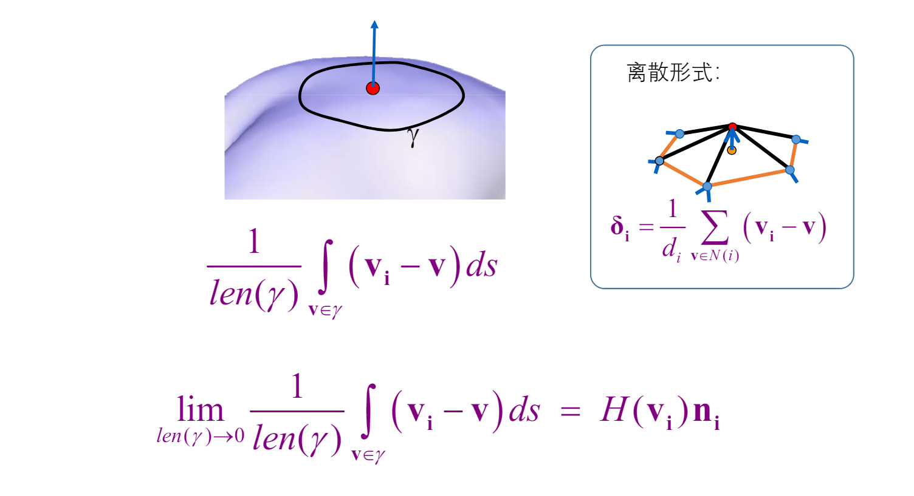

# 微分坐标
## 半边结构
对于三角形网格本身，已经有类似于`.obj`的文件格式可以很好的来表示了。但是这一类仅存储三角形网格面上每一个点、边、面的空间位置关系的数据结构，并不能很好的表示其连接性，我们最多只能知道每个边的两个顶点是谁，面的三个边是谁，但是没有每个边的相邻边或者相邻面的信息，换句话说就是，我们不能在常数时间内，通过一个点、边或者面，找到它相邻的点、边或者面的数据。而**半边数据结**构却能够很好的表示这种连接的信息。

半边数据结构的存储思路是与`.obj`文件完全不同的，`.obj`的存储思路是以**顶点**为基础进行存储的，而半边数据结构的存储核心是**半边**。

所谓半边，即是将**一个边**拆分为两个**半边**，每一个半边代表了从边的某一个顶点指向另一个顶点的有向的边，一个边两个顶点刚好构成了两个**方向相对**的半边。或者可以把半边理解为一个射线，而射线的端点就是半边所存储的数据。

```
HEdge {
    Vertex v; //半边的出发顶点
}
```

但是光是这样还是无法表示三角形网格的**连接关系**，因此必须有半边对于**点、面以及其他半边**的指针。

首先先看关于其他**半边**的关系，如果我们的要求是通过半边在常数时间内，查找三角形网格的连接关系，那么一个半边就至少要存储**一个**它相邻的半边`next`。一般而言我们选定半边所在的三角形面上，逆时针的下一个半边，当然，这顺带着也解决了半边与面的连接关系。

> 因为半边是一个有向的边，所以每一个三角形面可以按照其法线方向利用半边来表示，也就是说，比如有一个法线向外的三角形面，我们可以利用右手定则，反推该三角形面的朝向，而右手定则所规定的每一个边的方向，就是这个三角形面所拥有的半边。


```
HEdge {
    HEdge next;
    Vertex v; //半边的出发顶点
    Face f;
}
```

但是这样还不够，单独的半边无法表示一个完整的边的信息，也就是**边两头的顶点以及一条边所连接的两个面**，因此我们还需要其在同一条边上的另一个半边`pair`的信息。

```
HEdge {
    HEdge next,pair;
    Vertex v; //半边的出发顶点
    Face f;
}
```

这就是半边的数据结构，而对于三角形网格的顶点与面，则只需要存储与其相连的**半边**就行了。

+ 对于顶点，存储的半边指针就是将这个顶点作为起始点的半边。

+ 对于面，存储的就是随机一个满足它法线方向所规定的右手定则的方向的半边。

```
HEdge {
    HEdge next,pair;
    Vertex v; //半边的出发顶点
    Face f;
}

Face {
    // ... 其他面上的信息（例如法向量）
    HEdge he;
}

Vertex {
    // ... 其他顶点信息（例如UV坐标）
    HEdge he;
}
```


> 这张图半边所存储的顶点信息是它所指向的顶点，与前文有一些区别。

这就是半边数据结构的组成。

## Laplace算子
Laplace算子的定义如下：

$$\triangle f=\nabla\cdot\nabla f$$

其中， $\cdot$ 代表了向量点乘，此外，对于 $f(x,y)$ 可以写成如下形式：

$$\triangle f=\frac{\partial^2f}{\partial x^2}+\frac{\partial^2f}{\partial y^2}$$ 

实际上就是梯度的散度。

## 离散形式Laplace算子
其表示形式如下

$$\delta_i=v_i-\sum_{j\in N(i)}w_jv_j$$

其中 $N(i)$ 表示了  离散网格上的一个1-领域。


其推到过程如下，假设点 $v_i$ 沿 $xy$ 轴上下左右共有4个点 $f(x_{i+1},y_i),f(x_{i-1},y_i),f(x_i,y_{i+1}),f(x_i,y_{i-1})$ ，那么为了计算Laplace算子，先要计算其1阶导数：

$$f_{1\,x}^{'}(x_i,y_i)=\frac{f(x_{i+1},y_i)-f(x_i,y_i)}{x_{i+1}-x_i}$$
$$f_{2\,x}^{'}(x_i,y_i)=\frac{f(x_i,y_i)-f(x_{i-1},y_i)}{x_i-x_{i-1}}$$

可以发现在 $x$ 方向上可以计算出两个1阶导数，同理 $y$ 方向上也是，那么现在就可以利用这两个1阶导数计算2阶导数了。

$$f_{xx}(x_i,y_i)=\frac{f_{1\,x}^{'}(x_i,y_i)-f_{2\,x}^{'}(x_i,y_i)}{x_i-x_{i-1}}$$

同理可得 $y$ 方向的二阶导数。

现在假设 $x_{i+1},x_i,x_{i-1}$ 之间的间隔都是1，那么Laplace算子在某个方向上的分量就是（以 $x$ 方向为例）：

$$\frac{\partial^2f}{\partial x^2}=f(x_{i+1},y_i)-2f(x_i,y_i)+f(x_{i-1},y_i)$$

简写出来就是：

$$\triangle f(v_i)=\sum_j f(v_j)-4f(v_i)$$ 

其中 $j$ 代表了 $v_i$ 周围4个点。

> 当然要注意Laplace算子代表的是平均曲率，方向和开头的 $\delta_i$ 是刚好相反的，因为 $\delta_i$ 是我们的曲面平滑的优化点指向当前 $v_i$ 的向量，和曲率方向相反。

而真是情况并不会像我们假设的那样距离为1，而且我们需要的是一个**方向**，并不关心Laplace算子的大小，因此需要给予每一个 $v_i$ 周围的点权重，因此有了:

$$\delta_i=v_i-\sum_{j\in N(i)}w_jv_j$$

可以发现 $v_i$ 前的系数为1，也就是归一化过后了，而权重 $w_j$ 的选取也很有讲究，既可以选择给予每一个点一样的权重，也就是Uniform weight：

$$w_j=\frac{1}{N}$$

当然还有一种cotangent weight效果会更好：

$$w_j=\frac{cot\alpha+cot\beta}{\sum w_j}$$

其中 $\alpha$ 和 $\beta$ 是与点 $v_i,v_j$ 所形成的边相对的两个角。


## 平均曲率流
$$\lim\limits_{len(\gamma)\rightarrow 0}\frac{1}{len(\gamma)}\int_{\boldsymbol{v}\in\gamma}(\boldsymbol{v_i-v})d\boldsymbol{s}=H(v_i)n_i$$



其中 $v_i$ 表示的是中心的点, $H(v_i)$ 表示了在点 $v_i$ 上平均曲率的方向与大小， $n_i$ 是单位法向量， $v$ 为在曲线 $\gamma$ 上的任意一点。

**实际上Laplace算子就是代表了平均曲率流。**

## 曲面平滑
有了Laplace算子，就可以对曲面进行平滑的操作了：

$$P_{new}\leftarrow P_{old}+\lambda H(P_{old})n(P_{old})$$

写成向量的形式就是：

$$Lv=\delta$$

其中 $v$ 为列向量，其中存储的是每一个顶点的坐标信息， $L$ 是拉普拉斯系数矩阵，就是符合 $\delta_i=v_i-\sum_{j\in N(i)}w_jv_j=\frac{1}{d_i}\sum_{v\in N(i)}(v_i-v)$ ，可以写为：

$$L=I-D^{-1}A$$

其中 $I$ 为单位矩阵，且

$$A_{ij}=\begin{cases} \begin{array}{rcl} 1 & i\in N(j) \\\\ 0 & otherwise \end{array}\end{cases}$$

$$D_{ij}=\begin{cases} \begin{array}{rcl}d_i & i=j \\\\ 0 & otherwise \end{array}\end{cases}$$

> 此处是使用Uniform weight。

或者写成满足 $\delta_i=v_i-\sum_{j\in N(i)}w_jv_j=\sum_{j\in N(i)}w_{ij}(v_i-v_j)$ 的 $L$ 也可以，此时就可以使用cotangent weight的行驶了。

当然因为曲面光滑最终的结果是 $\delta=0$ ，所以如果能够先求出L，那么只需要计算如下的矩阵方程：

$$Lv=0$$

就可以得到 $v$  的值，此处 $v$ 的值就是最终曲面平滑的值。