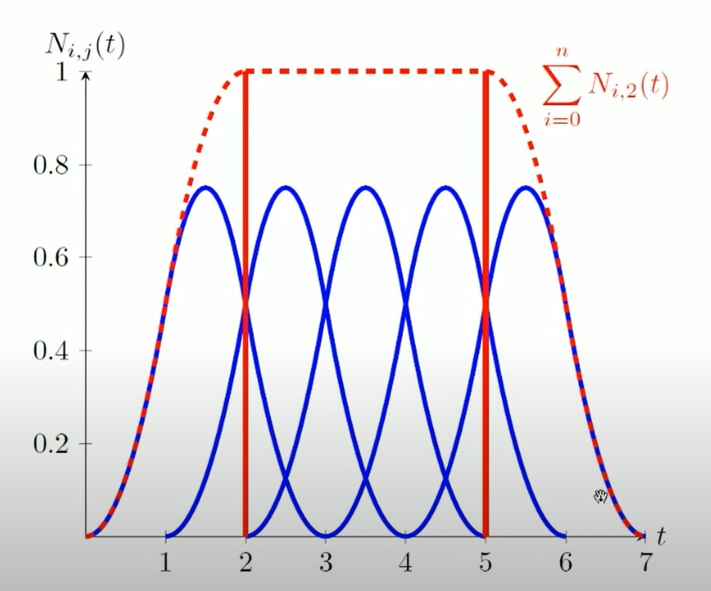
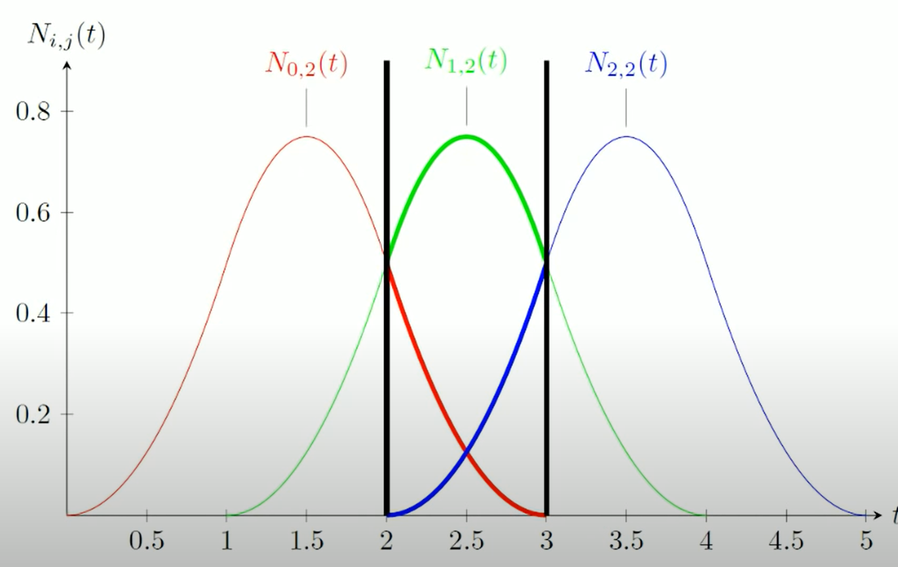

# Bezier曲线和B样条

## 参数化表述曲线
### 参数化想法来源
对于一个曲线，例如一个单位圆，在二维平面上我们一般都可以这样定义：

 $$x^2+y^2=1$$

或者用隐式函数定义：

 $$f(x,y)=x^2+y^2-1=0$$

但是这样的定义方式虽然在数学上是有道理的，但是在实际的工程中却并不直观与方便，更好的对于一条曲线的操作方式是例如PhotoShop中的钢笔工具一样，能够有几个控制点去控制曲线的形状，或者更直观的说，对于一条曲线，如果能直接拿一只笔画出来就更好了。

那么顺着这个思路，我们拿笔画线的方式实际上就是在一段**时间**内，在一个二维平面画出曲线，那么就是说我们可以通过时间来确定我们的笔尖在二维平面的所在位置：

 $$f:t\mapsto (x,y)$$

这样一个被称作 $f$ 的操作能够让我们在输入一个时间点t后，返回给我们一个坐标 $(x,y)$ ，这个 $f$ 便是参数化曲线函数:

 $$f(t)=(x,y)$$

### 样条
但是就像在我们用笔画图时一样，有些时候我们会画直线，有些时候会画曲线，甚至波浪线，每一种不同的线段类型都对应了不同的参数化函数表达式（一次函数、多项式函数、周期函数），那么这就需要**分段化**表示曲线。

但是如果真的提供了这么多种类的曲线，实现起来会变得极其复杂，最好有一种函数，能够**统一**表达**每一段**曲线，这样就能够简化很多操作，这样的**每一段**被称作*样条*，而找到一种能够很好的**统一**表达*样条*形状的函数，便是参数化曲线的关键。

> 值得一提的是，这里所作的曲线函数都是建立在插值的基础上的，因为情况是这样的：一般来讲工程上都是先给出许多的点，然后要求系统依据这些点，画出一条能够穿过这些点的曲线，而这样去求穿过所有给定的点的函数的操作，就被称作插值。

### 曲线特征
在开始研究曲线前还要明确一些曲线的特征，毕竟这些特征，或者说能够代表一条曲线长成什么样子的属性（例如说，一个圆形曲线的特征是它的半径长度 $r$ ），才是研究曲线的关键，一般我们都会去关心一条曲线的这几个特征：

+ 连续性（样条段是不是都接在一起而不是断开了）
+ 位置（在t时，曲线画到哪里了，是不是在一个插值点上，或者画到终点了）
+ 方向（曲线往哪里画）
+ 曲率（曲线有多弯）

### 多项式表达
根据Weierstrass定理，任意一条曲线都能被多项式表达。乍听上去很高大上，但这也符合直觉，可以类比于泰勒级数，通过一系列多项式去近似一个点附近的曲线，只不过Taylor Series是关心的曲线上一个点的局部，而Weierstrass定理给出了一整条曲线。

一个参数化曲线的多项式表达可以这样写出：

 $$f(t)=a_0+a_1t+a_2t^2+\cdots+a_nt^n$$

当然可以简写为：

 $$f(t)=\sum_{i=0}^n{a_it^i}$$  

这种形式也被称为多项式的标准形式(*canonical form of polynomial*)

可以多做一步工作，再对这个*标准形式*的多项式抽象，把 $t^n$ 这样的多项式抽象为 $b_i(t)=t^i$ ，顺便把 $a_i$ 换成字母 $c_i$ 然后再一次简写多项式表达式：

 $$f(t)=\sum_{i=0}^n{c_ib_i(t)}$$  

之所以改写成这种形式，是因为实际上 $b_i(t)$ 是可以选择的，比如Bernstein多项式（ $b_i(t)=C_n^it^i(1-t)^{n-i}$ ），不一定局限于 $b_i(t)=t^i$ 的形式。

此外，对于系数 $c_i$ 的选取也很重要，因为如果 $c_i$ 选择的好，这些系数可以有很强的几何意义，就像下面的Beizier曲线一样，能够在工程上十分直观。

### 矩阵表示
既然是计算多项式，那必定少不了矩阵表达，毕竟矩阵诞生的目的就是用来解多项式，首先从一条直线段开始，假设只给两个点 $p_0,p_1$ ，需要画出这两个点之间的直线段，那非常简单：

 $$\begin{cases}x(t)=x_0 + t(x_1-x_0) \\\\ y_(t)=y_0+t(y_1-y_0)\end{cases} \tag{1}$$

进一步，可以写成向量的形式：

 $$f(t)=\begin{pmatrix}x_0 \\\\ y_0\end{pmatrix}+t(\begin{pmatrix}x_1 \\\\ y_1\end{pmatrix}-\begin{pmatrix}x_0 \\\\ y_0\end{pmatrix}) = \boldsymbol{p_0}+t(\boldsymbol{p_1-p_0}) \tag{2}$$

 现在先停一下，先再从另一个方面来看 $f(t)$ ，如上文所提， $f(t)$ 可以被写为多项式的形式 $f(t)=\sum_{i=0}^n{a_it^i}$ ，其实这种形式可以很容易让人想到两个向量的内积，则：

 $$\boldsymbol{t}=\begin{bmatrix}1 & t & t^2 & t^3 &\cdots & t^n \end{bmatrix} \tag{3}$$  

对于系数 $a_i$ ,也可以写为：

 $$\boldsymbol{a}=\begin{bmatrix}a_0 \\\\ a_1 \\\\ a_2 \\\\ a_3 \\\\ \cdots \\\\ a_n \end{bmatrix} \tag{4}$$  

 则 $f(t)$ 可以用向量写成：

  $$f(t)=\boldsymbol{t \cdot a} \tag{5}$$  

之所以大费力气写成向量的形式，是因为我们想要求出**系数**，写成这样是为了接下来的矩阵运算。先观察(2)式，我们可以很容易得出 $f(0)=p_0,f(1)=p_1$ 的结论，这也是符合直觉的，在我们的“钢笔”在开始画曲线时将笔尖落在了 $p_0$ 点，在结束时画到了 $p_1$ 点。同时我们将 $t=0$ 和 $t=1$ 代入 $f(t)=\boldsymbol{u \cdot a}$ 的向量表达中，就有了：

 $$f(0)=p_0 = \begin{bmatrix} 1 & 0 \end{bmatrix} \begin{bmatrix} p_1 & p_0 \end{bmatrix}$$  

 $$f(1)=p_1 = \begin{bmatrix} 1 & 1 \end{bmatrix} \begin{bmatrix} p_1 & p_0 \end{bmatrix}$$  

> 因为这个例子中还只是用直线表达两个点之间的*曲线*，因此向量t和a的大小都是 $(1 \times 2)$ 

那么进一步写成矩阵形式就是：

 $$\begin{bmatrix}p_0 \\\\ p_1\end{bmatrix}=\begin{bmatrix}1 & 0 \\\\ 1 & 1 \end{bmatrix}\begin{bmatrix}a_0 \\\\ a_1\end{bmatrix}$$

 $$\boldsymbol{p}=\boldsymbol{Ca}$$

 $$\boldsymbol{C^{-1}p}=\boldsymbol{a}$$

设 $C^{-1}=B$ ,

 $$\boldsymbol{a}=\boldsymbol{Bp}$$

则对于曲线函数 $f(t)$ ,就有了

 $$f(t)=\boldsymbol{t B p}$$

这个矩阵 $\boldsymbol{B}$ 被称为*基矩阵*，在之后的曲线计算中有着十分重要的作用。

写了这么多公式到底是为了什么呢？再回想一下我们是准备怎样去画一条曲线——**利用多项式去画**，那么为了表示一条特定的曲线，多项式缺什么？缺**系数**，所以做了这么多就是为了求系数，而这个系数就是 $\boldsymbol{a}$ ，虽然a确实可以通过许多方式直接求出来，但这样的多项式方程是不直观的，但是当把 $\boldsymbol{a}$ 转换为 $\boldsymbol{Bp}$ 的形式后， $\boldsymbol{Bp}$ 还带来了一些额外的信息，也就是 $\boldsymbol{p}$ ,如果能够通过控制这些*结点* $\boldsymbol{p}$ 的位置来控制曲线方程的值，也就是曲线，那在工程上是十分便利的，这就是以上做了这么多矩阵变换的原因所在。

## Beizier曲线
在开始B样条之前，必须先看一下Beizier曲线，Beizier曲线是一种可以通过控制点控制的，参数化曲线，其曲线定义如下：

如果一共有 $n+1$ 个控制点，即点 $(P_0, P_1, \cdots, P_n)$ ，那么一条Beizier曲线的参数化函数为：

 $$C(t)=\sum_{i=0}^n{b_{i,n}(t)P_i},$$

 $$b_{i,n}(t)=\begin{pmatrix} n \\\\ i \end{pmatrix} t^i(1-t)^{n-i}$$

> 其中 $b_{i,n}(t)$ 被称为Bernstein基。

但是这个定义太数学了，往往很难直观感受，于是可以有另一种递归定义的方式，这种方式更优雅：

可以看到它是有一系列点的运动递归定义的。想象每两个控制点之间都有一个运动的点，而每个点的坐标都是这样运动的：

 $$Q_0=P_0+t(P_1-P_0)=(1-t)P_0+tP_1$$
 $$Q_1=P_2+t(P_2-P_1)=(1-t)P_1+tP_2$$
 $$Q_2=P_3+t(P_3-P_2)=(1-t)P_3+tP_2$$

也就是每一个递归定义的点 $Q_0,Q_1,Q_2$ ，在他们所在的直线上，在 $t\in[0,1]$ 的时间内从直线的一端走到另一端。

这是第一次递归，也就是图中 $\textsf{{\color{green}绿色}}$ 的线.

那么接着递归定义 $\textsf{{\color{blue}蓝色}}$ 的线，在 $t\in[0,1]$ 的时间内从 $\textsf{{\color{green}直线}}$ 的一端走到另一端。最后再在 $\textsf{{\color{blue}蓝色}}$ 的线上，最后一次递归定义 $\textsf{{\color{red}点}}$ 的位置，而这个 $\textsf{{\color{red}点}}$ 在空间中走过的位置，就是Beizier曲线。

> 所有递归定义的点都是在 $t=0$ 的时候开始运动，在 $t=1$ 的时候到达他们各自的终点的。

那么这样可以给出递归定义的数学表达式：

 $$P_{i,j}=(1-t)P_{i,j-1}+tP_(i+1,j-1)$$  

这个公式又被称作**de Casteljau算法**。

不过一般来讲对于贝塞尔曲线，只会应用到三次贝塞尔曲线，也就是 $C^2$ 连续即可，所以可以直接通过**de Castekjau算法**推导出基矩阵和它的矩阵表达式：

 $$\begin{equation}\begin{aligned}f(t)=P_{0,3}=&(1-t)P_{0,2}+tP_{1,2} \\\\ =&(1-t)^2P_{0,1}+2t(1-t)P_{1,1}+t^2P_{2,1} \\\\ =&(1-t)^3P_{0,0}+3t(1-t)^2P_{1,0}+3t^2(1-t)^2P_{2,0}+t^3P_{3,0} \\\\ =&(1-3t+3t^2-t^3)P_{0,0}+(0+3t-6t^2+3t^3)P_{1,0}+(0+0t+3t^2-3t^3)P_{2,0}+(0+0t+0t^2+t^3)P_{3,0} \\\\ =&\begin{bmatrix} 1 & t & t^2 & t^3 \end{bmatrix} \begin{bmatrix} 1 & 0 & 0 & 0 \\\\ -3 & 3 & 0 & 0 \\\\ 3 & -6 & 3 & 0 \\\\ -1 & 3 & -3 & 1 \end{bmatrix} \begin{bmatrix} P_0 \\\\ P_1 \\\\ P_2 \\\\ P_3 \end{bmatrix}\end{aligned}\end{equation}$$

## B样条函数

之所以要先提Beizier曲线，是因为B样条曲线（B-Spline）的定义方式比较复杂，公认最好理解的B-Spline的定义方式也是递归的，先给出定义：

 $$N_{i,0}=\begin{cases} 1 & if\quad t_i \le t \le t_{i+1} \\\\ 0 & \text{otherwise} \end{cases}$$

 $$N_{i,k}=\frac{t-t_i}{t_{i+k}-t_i}N_{i,k-1}(t)+\frac{t_{i+k+1}-t}{t_{i+k+1}-t_{i+1}}N_{i+1,k-1}(t)$$

其中k表示B样条的阶数，也就是曲线函数的阶数，也就是多项式 $t^k$ 最高次是多少，比如说 $k=3$ 是三次函数曲线。
是不是觉得眼熟，如果不觉得眼熟也没关系，我们做一个对比：

 $$N_{i,k}=\frac{t-t_i}{t_{i+k}-t_i}N_{i,k-1}(t)+\frac{t_{i+k+1}-t}{t_{i+k+1}-t_{i+1}}N_{i+1,k-1}(t)$$  
 
 $$P_{i,j}=(1-t)P_{i,j-1}+tP_(i+1,j-1)$$  

在**de Casteljau算法**中，我们默认整条Beizier曲线都递归定义在 $t\in[0,1]$ 的区间上，而且仔细观察会发现，在**de Casteljau算法**中，如果不像三次Beizier曲线那样分段连接（ $i=0,1,2,3$ ），而是直接考虑全部加入的点的话，那么贝塞尔曲线的函数将会是 $n$ 阶多项式，你可能会觉得这很不错，因为这样能获得一个 $C^{n-1}$ 连续的曲线，但问题是：_**工程上**_如果想要通过控制点调节一个曲线的形状（比如说汽车的外形设计），一般来讲只会想要在局部进行微调，但如果曲线是一个高阶多项式插值的结果，那么很有可能牵一发而动全身，直接让整个曲线**飞**到不知道哪里去了，因此这是我们不希望看到的，而B样条就是为了解决这个问题的，也就是人为引入一些局部性，让我们在拖动控制点的时候，只影响局部的曲线，那现在再回头看B样条的定义是不是清楚了一些：

对于这个式子：

 $$N_{i,0}=\begin{cases} 1 & if\quad t_i \le t \le t_{i+1} \\\\ 0 & \text{otherwise} \end{cases}$$

这个式子就像一个开关，它告诉我们何时打开这个**函数**的影响，但是，为什么是**函数**？不应该像Beizier曲线一样最低阶是直接作用在控制点上的吗？这是因为基函数的性质（Basic function，也是B样条B的来源）。

我们一共有 $n+1$ 个控制点，每个控制点都会对一小段曲线有影响，那么这个影响范围是多大呢，这里就要引入**结点向量**的概念，结点结点向量是这样定义的：

 $$T=(t_0,t_1,\cdots,t_m),$$

 其中 $m=n+k+1$ 。
 
 为什么m会是这个数？首先，想象一下我们要画一个 $C^2$ 连续的曲线，那么就是说我们一定会需要一堆3次多项式，每一个3次多项式代表一段曲线，然后将这些曲线连起来，那么算一个3次多项式 $f(t)=at^3+bt^2+ct+d$ 要几个式子呢？4个！4个未知数4个（线性无关）式子就能求出来。那么从第0个点，到第n个点，一共有 $n+1$ 个区间，而B样条的计算只从第 $t_k$ 开始，所以， $m=n+k+1$ ， 可能有点难理解，但如果将 $N_{i,k}$ 的基函数曲线画出来，可能能更好理解：

 

 这是一张 $k=2$ 的二次B样条的**基函数图像**，从图中可以看到， $\textsf{{\color{red}红色直线}}$ 框出来的范围是实际B样条画出来的范围，可以看到这一个区间内，在任意 $t\in[t_i,t_{i+k})$ 的区间内，在纵向上都有3条曲线叠加，换一张，更清楚的图：

 

 同样也是2次B样条曲线的基函数图，只不过这次我们减少了点的数量，让 $n=2$ ，也就是一共有3个控制点，可以看到B样条曲线只会去画在纵向上有 $k+1$ 个点对他影响时的图像，那么B样条开始画的起始时间，就是 $t_k$ 时间，注意，这里其实就引出了一个概念，你会发现每一小段时间 $\Delta t$ 都为1，因此这样的B样条也被称为均匀B样条，因为小的时间间隔都是 $\Delta t=1$ 。

 但是你可能想说，不对啊，如果按照Beizier曲线的方法，开始画的时间应该是 $t=0$ 的时候，为什么B样条从 $t_k=k$ 的时候开始画了，这有问题！是的，这真的有问题，因此就有了Open Uniform Bspline（没找到中文翻译），这个B样条是这样定义结点向量（也就是时间**段**）的:  

  $$T=\( \underbrace{0,0,\cdots,0}_{k个结点},0,1,2,\cdots,n,\underbrace{n,n,\cdots,n}_{k个结点} \)$$  

那么这样就真的完完整整的把B样条框在了 $t\in[0,n]$ 中了。当然一般来讲对于t会把他定义在 $t\in[0,1]$ 上，因此再回看这个递归式子（**de Boor-cox算法**）

 $$N_{i,k}=\frac{t-t_i}{t_{i+k}-t_i}N_{i,k-1}(t)+\frac{t_{i+k+1}-t}{t_{i+k+1}-t_{i+1}}N_{i+1,k-1}(t)$$  

这个式子 $\frac{t-t_i}{t_{i+k}-t_i}$ 和 $\frac{t_{i+k+1}-t}{t_{i+k+1}-t_{i+1}}$ 部分其实就是因为我们把t定义在了 $t\in[0,n]$ 上，所以要做归一化，再把t定义在 $t\in[0,1]$ 上。

至此B样条算是终于结束了。

> 当然还留了一个问题，凭什么每个点之间的间隔 $\Delta t$ 都等于1？明明点和点之间的距离都不一样，不可能每一个控制点之间的距离是一样的，那么为了解决这个问题，就会引出NURBS(Non-Uniform Rational B-Spline)，也就是非均匀有理B样条。

