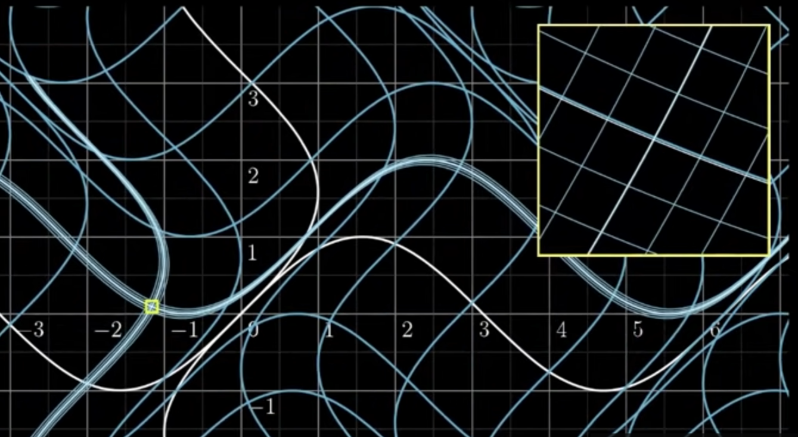
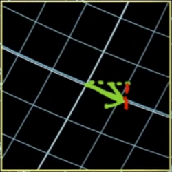
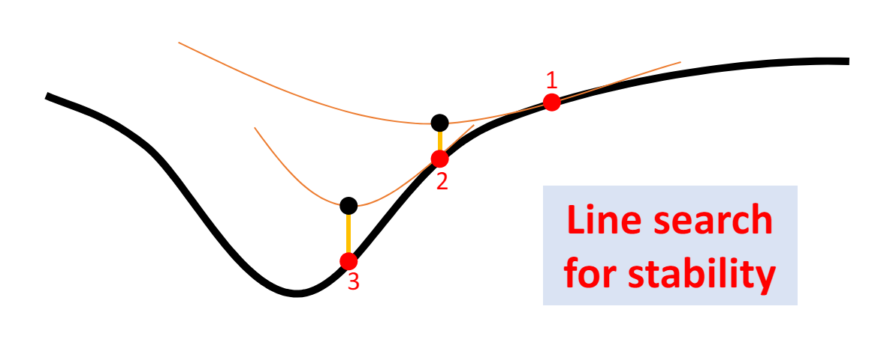

# 几何映射 几何优化
## 映射的性质
一个好的映射应该有如下两个性质：
+ 双射
+ 低扭曲

双射分**局部双射**与**全局双射**。

对于扭曲的度量一般采用雅可比矩阵 $\mathcal{J}$ ,雅可比矩阵的形式是：

$$\mathcal{J}=\begin{bmatrix} \frac{\partial f_1}{\partial x_1} & \frac{\partial f_1}{\partial x_2} & \cdots & \frac{\partial f_1}{\partial x_k}\\\\ \frac{\partial f_2}{\partial x_1}  & \frac{\partial f_2}{\partial x_2} & \cdots & \frac{\partial f_2}{\partial x_k} \\\\ \vdots & \vdots & \ddots & \vdots \\\\ \frac{\partial f_n}{\partial x_1} & \frac{\partial f_n}{\partial x_2} & \cdots & \frac{\partial f_n}{\partial x_k} \end{bmatrix}$$

特别的，对于二维平面上的雅可比矩阵为：

$$f(x,y)=\begin{pmatrix}u(x,y) \\\\ v(x,y)\end{pmatrix}$$
$$\mathcal{J}f(x)=\begin{bmatrix} \frac{\partial u}{\partial x} & \frac{\partial u}{\partial y} \\\\ \frac{\partial v}{\partial x} & \frac{\partial u}{\partial y} \end{bmatrix}$$

其解释是这样的：整个空间在 $f(\boldsymbol{x})$ （ $\boldsymbol{x}\in\mathbb{R}^n$）的作用下会产生**扭曲**，虽然这个扭曲不一定是线性的（也就是说不一定是平移、旋转、缩放或者切变），但是我们可以把一个极小的区域内的扭曲看作线性的变化

> 图中函数为： $$f( \begin{bmatrix} x \\\\ y \end{bmatrix} )= \begin{bmatrix} x+sin(y) \\\\ y+sin(x) \end{bmatrix} = \begin{bmatrix}f_1(x,y) \\\\ f_2(x,y) \end{bmatrix}$$ ，显然这不是一个线性变换，但是在极小的局部（黄框所在地方），这可以被近似为一个线性变换。

那么对于一个极小的局部，它的线性变换矩阵就是雅可比矩阵。

换句话说，雅可比矩阵是一个表示局部变化的矩阵，而要如何表示这样的变化呢？答案就是衡量各个数轴方向的分量 $x_i$ （在二维空间中就是 $x,y$ 这两个方向的分量）在变化后的朝向与大小，当然这样的衡量肯定是局部的，也就是要取 $\Delta x_i$ 且 $\Delta x\rightarrow 0$ 。

还是用上图举个例子，绿色箭头表示了我们在局部很小的地方，沿 $x$ 轴向前走很小的一部，即 $\Delta x$ ，那么这在变换后会是怎样的向量？很明显， $\Delta x$ 同时参与了 $f_1$ 和 $f_2$ 的计算，因此 $\Delta x$ 对于 $f_1$ 和 $f_2$ 的贡献分别是 $f_1(x+\Delta x,y)-f(x,y)$ 和 $f_2(x+\Delta x,y)-f_2(x,y)$ 。显然，这就是局部的微分量了，我们把它改写成向量，且是偏导数的形式，即 $\begin{bmatrix}\frac{\partial f_1}{\partial x} \\\\ \frac{\partial f_2}{\partial x}\end{bmatrix}$ ， 因为是偏导数的形式，那么这个向量就表示了 $x$ 轴在 $f(x,y)$ 的变换后的朝向与大小了，同样的操作也可以用在 $y$ 轴上，就可以写出雅可比矩阵了。

既然雅克比行列式表示了函数 $f$ 施加在空间上的变换的局部信息，且行列式的几何意义就是矩阵对空间进行变换后空间的缩放比例，那么只需要求 $det(\mathcal{J}f(x))$ ，就可以得到局部的缩放大小，即经过函数 $f$ 映射后，局部**扭曲**的大小了。

那么对于二维平面 $\mathbb{R}^2$ ，如果 $det(\mathcal{J})>0$ ，就可以认为函数 $f$ 没有让局部发生**翻转**

## 几何优化
### 优化问题的一般形式
要对一个某一样东西进行优化，我们就必须找到一种度量，也就是必须有这样一个函数： $f:\mathbb{R}^n\mapsto\mathbb{R}$ ，通俗点讲就是我们要给我们需要优化的某样东西“打个分”，将其映射到实数域上去，那么换成数学语言就是：

$$min_{x\in\mathbb{R}^n} \quad f(x)$$

当然有些时候优化也是有条件的，在不同的条件下，我们对某样东西的判断标准会改变，比方说对于车子的评价，我们有些时候的打分标准是它的动力，有些时候是它的外观，是视情况而定的，因此还必须有**约束公式** $g(x)=0$ 和 $h(x)\ge0$ （等式约束和不等式约束），总体来说优化问题的数学表达就是：

$$min_{x\in\mathbb{R}^n} \quad f(x)$$
$$g(x)=0$$
$$h(x)\ge0$$

### 无约束的优化问题
如果是一个无约束的优化问题，那么一般会采用**梯度下降法**或者**牛顿法**。

梯度下降法比较熟悉，深度学习领域已经广泛应用这种方法了：

$$x_{k+1}=x_k-\alpha_k\nabla f(x_k)$$

牛顿法的优化思路是用一个抛物线去替代梯度下降法中的学习率 $\alpha$ ，即：

$$x_{k+1}=x_k-[Hf(x_k)]^{-1}\nabla f(x_k)$$

其中， $H$ 是Hessian矩阵，矩阵中下标为 $ij$ 的项为：

$$H_{ij}=\frac{\partial^2 f}{\partial x_i \partial x_j}$$

其原理来自泰勒展开，对于 $x\in\mathbb{R}^n$ ，函数值 $f(x)$ 的近似可以写为为：

$$f(x)\approx f(x_0)+\nabla f(x_0)^T(x-x_0)+\frac{1}{2}(x-x_0)^THf(x_0)(x-x_0)$$

类比以下 $x\in \mathbb{R}$ 情况下的泰勒展开：

$$f(x)=f(x_0)+f^{'}(x_0)(x-x_0)+\frac{f^{''}(x_0)}{2}(x-x_0)^2$$

思路就是保证等式右侧的0阶导数、1阶导数、2阶导数……都和等式左侧相等。

