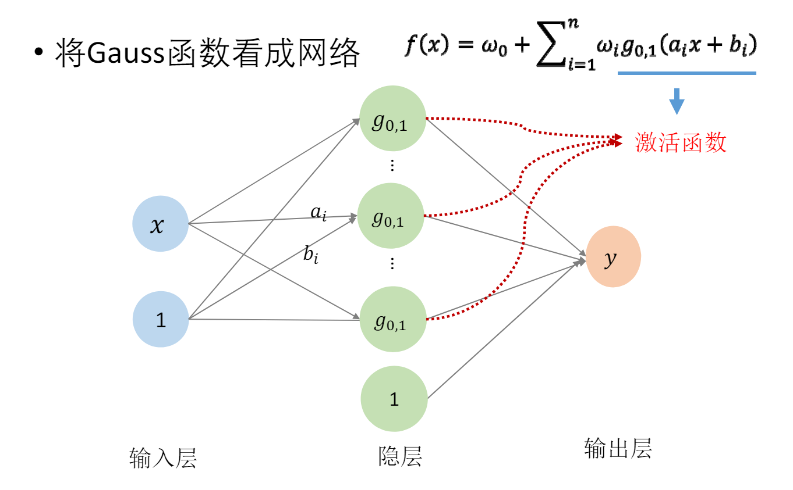
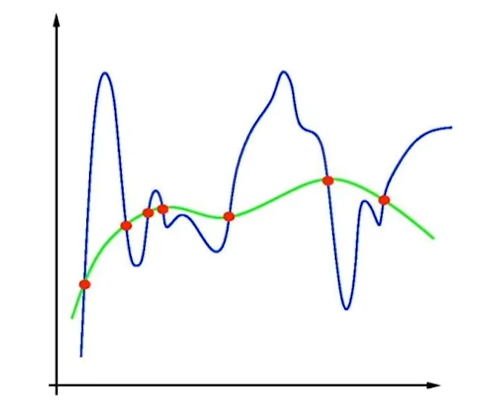

# 插值与拟合
## 插值
插值是通过给定的一组点去还原原来的函数曲线。

### Lagrange插值法
对于给定的 $n+1$ 组离散的点： ${(x_0,y_0),(x_1,y_1),(x_2,y_2),\cdots,(x_n,y_n)}$ ，拉格朗日插值法的想法是找到一种开关 $L_p(x)$ ，每当插值出的多项式曲线通过所给定的某一个离散点 $(x_p,y_p)$ 时，就使得其他项失效，仅留 $y_p L_p(x_p)$ ，且 $L_p(x_p)=1$ ，因此可以定义 $L_i(x)$ 为：

$$L_i(x)=\prod_{j=0,j\ne i}^n\frac{x-x_j}{x_i-x_j}$$

从该拉格朗日基数可以看出，对于点 $(x_i,y_i)$ ，其值为1，而当 $x$ 为其余所给离散点的 $x$ 值时，该基数为0。

拉格朗日插值法所插值的函数可以被写为：

$$f(x)=\sum_{i=0}^ny_iL_i(x)$$

## 拟合
拟合是指根据一组数据，这组数据因为是通过采样等方式得到的，因而有概率存在误差，因此只尝试找到一个函数或曲线，使其最好地描述这组数据的趋势或规律，是一种尝试去逼近原来的函数的方法。

### 最小二乘法
最小二乘法的思想是通过缩小我们所假设的曲线与采样的函数值之间的误差到最小，从而得到拟合曲线的方法，其数学表达为：

$$min\sum_{i=0}^n(y_i-f(x_i))^2$$

一般是通过求各个参数的偏导数并令其为0，接触法方程而得出所求函数结果。

### Weierstrass定理
除了通过使用最小二乘法后采用法方程求解或者梯度下降法求解外，还可以通过使用“多项式拟合”的方式求解曲线。之所以能够使用多项式方法，主要是因为有Weierstrass定理做支撑，即任意连续函数，都存在多项式能够表达这个曲线：

$$\forall \epsilon,\exists n,\forall x\in[a,b] \;|f(x)-P_n(x)|<\epsilon$$

### RBF函数
除了使用多项式作为基函数（如Bernstein多项式）去拟合函数，还可以使用Gauss函数作为基函数去拟合，这就是RBF函数：

$$f(x)=b_0+\sum_{i=1}^nb_ig_i(x)$$

$$g(x)=\frac{1}{\sqrt{2\pi}\sigma}e^{-\frac{(x-\mu)^2}{2\sigma^2}}$$

其中，当 $\sigma=1,\mu=0$ 的时候则是标准正态分布，实际上可以这样定义 $g(x)$ ，把所有的 $g(x)$ 都变为类似于标准正态分布的形式：

$$g(x)=\frac{1}{\sqrt{2\pi}}e^{-\frac{1}{2}(\frac{x}{\sigma}-\frac{\mu}{\sigma})^2}$$

这样定义基函数，就可以将 $e$ 的次数也转化为一个线性的方程：

$$\frac{x}{\sigma}-\frac{\mu}{\sigma}=ax+b$$

并使原先每个 $g(x)$ 前的系数 $b_i$ 吸收掉 $\frac{1}{\sigma}$ 成为 $\omega_i$ ，则重新组织出的公式为：

$$f(x)=b_0+\sum_{i=1}^n\omega_ig(a_ix+b_i)$$

这就是RBF函数，之所以要将 $g(x)$ 改写为以标准正态本部为底的形式，主要是为了适应人工智能领域的训练，也就是说，可以将标准正太分布函数视作一个激活函数，如图所示:

## 过拟合
虽然通过拟合的方法可能可以得到与采样点误差很小的函数，但该函数的其他部分与实际函数图形相差甚远，这种现象就是过拟合。

### 过拟合的修正方法
#### 岭回归
通过最小二成可以得到回归系数向量 $W=[w_0,w_1,\cdots,w_n]$ ，将其模乘以一个惩罚系数作为惩罚项，通过考虑这个惩罚项来进行正则化的方法被称为岭回归：

$$min||Y-WX||^2+\alpha||W||_2^2$$

其中 $\alpha$ 为控制系数， $\alpha$ 越大曲线越平滑，但也会倒置欠拟合。

#### 稀疏正则化
稀疏正则化考虑到了有些时候所得函数的基函数可能有很多线性相关的项，因此为了减少函数的过完备性，必须减少系数不为0的基函数的个数：

$$min||Y-WX||^2+\alpha||W||_0$$