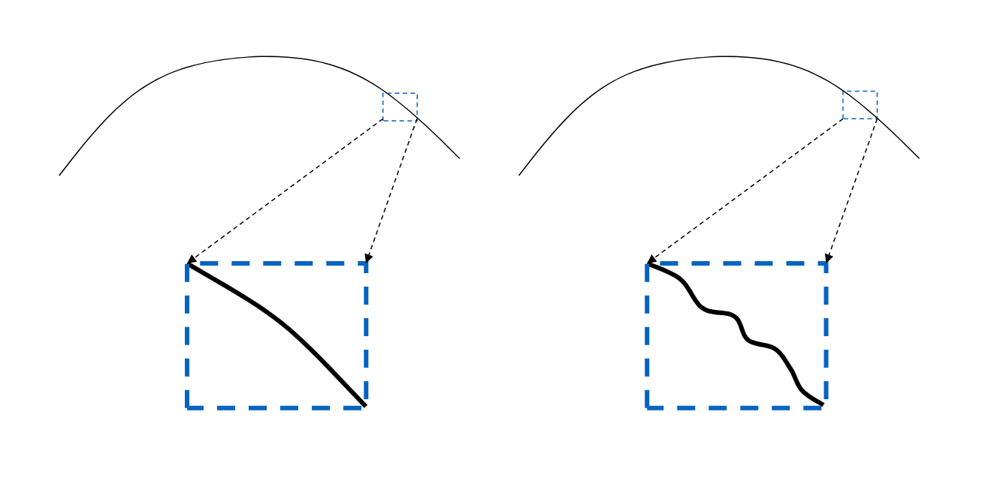

# 曲线光顺
## 什么是光顺
曲线光顺是我们对于曲线是否足够好的又一个评判标准，即便有些曲线能够达到 $C^\infty$ ，但是如果考察其局部细节的话依然会发现它不够“光滑”，而“光滑”缺在许多工程应用中有很重要的作用，比如说轮船的表面曲线设计，轮船的表面即便连续性再好，如果不够光滑，那么在航行过程中水流带来的阻力也是十分巨大的。

## 曲率
虽然发现了曲线光顺与否十分重要这个问题，但是在解决这个问题之前，必须有对曲线到底怎样才算“光顺”的一个评判标准才行，这样的评判标准就是**曲率**。

在定义曲率之前，可以先看一下曲线的切线，因为切线代表了曲线“行进”的方向：

$$T=C^{'}(t)=\frac{dC(t)}{dt}$$

曲率从定义上来看就是衡量一个曲线的弯曲程度，而这个弯曲程度实际上是相对于曲线的“行进”方向而言的，换句话说就是，曲率是个常量，它的正负号所体现的是相对于曲线切线方向的“拐弯”方向，那么曲率的定义就是：

$$\kappa=||\frac{dT}{ds}||=\frac{||\frac{dT}{dt}||}{||\frac{ds}{dt}||}$$

但为什么不是 $||\frac{d^2T}{dt^2}||$ 呢？因为我们在考察的是曲线本身的性质，如果只是对参数本身进行2阶导，那么实际上只能体现曲线在“单位时间”内“拐弯”的有多快，并不能表示在曲线的某个**地方**拐弯的有多快，因此曲率的另一层含义就是：*在曲线上行进一小点距离，会导致我的朝向发生多少变化*。
## 曲线光顺的定义
有了定义的标准，就可以对曲线光顺进行定义了：

1. 他是 $C^{l+1}(l>0)$ 连续的
2. 它的拐点较少
3. 它的曲率的拐点较少
4. 它的曲率变化的振幅较小

# 离散曲线
## 从离散到连续
将一个已经离散了的曲线复原为连续的曲线可以采用几何迭代法，其基本思想如下：
1. 将已经给定了的离散曲线上的顶点作为**控制点**，先构造出一条曲线。
2. 因为曲线是参数化定义的，所以可以得到每一个**顶点**所对应的在曲线上的点。
3. 计算顶点到曲线上的点之间的距离误差 $\boldsymbol{\Delta}$ 。
4. 如果不存在误差，则结束迭代；如果存在误差，则将**控制点**按照 $-\boldsymbol{\Delta}$ 的方向与距离移动，返回步骤1。

通过这样的方法可以将离散的曲线再次还原为连续曲线，并且能够获得其控制点的位置。

## FFD(Free-form Deformation)
FFD的思想就是将曲面转化为一个Beizier曲面，那么对于曲面的变形实际上就相当于对于Beizier曲面的控制点的移动。