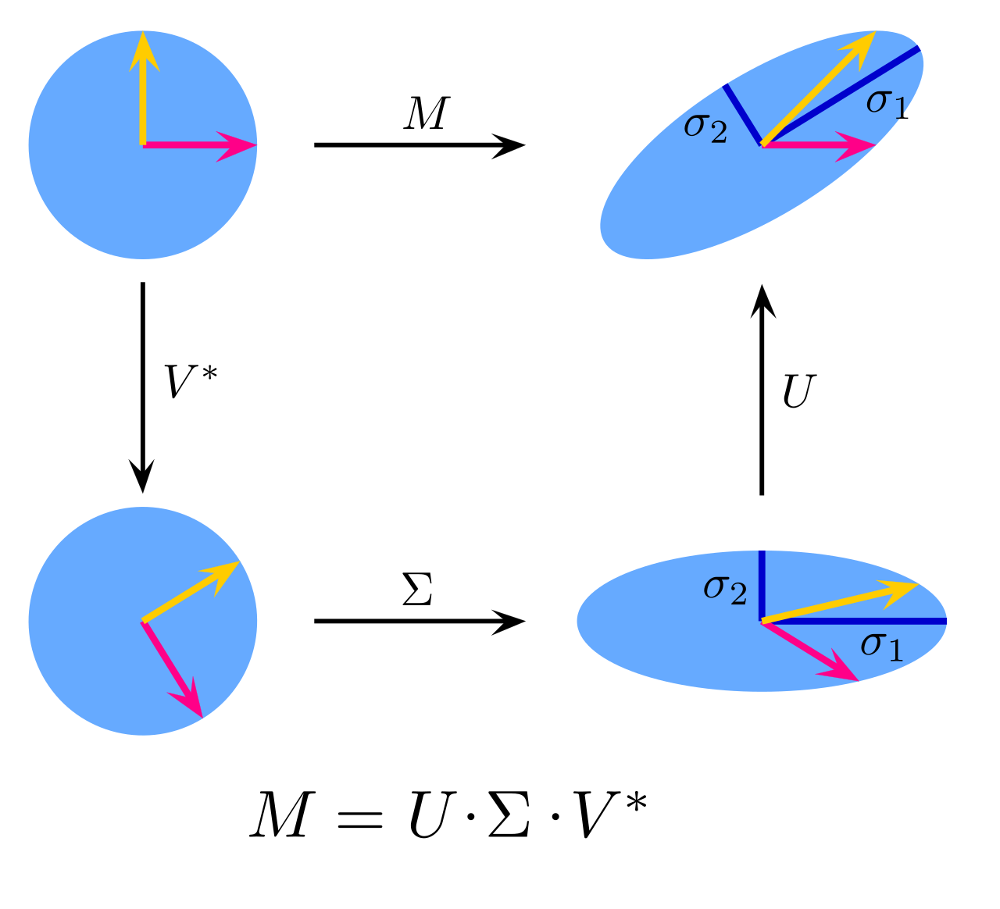

# 曲面参数化 曲面简化
## 什么是曲面参数化
在三维空间中的一个曲面 $S$ 实—质上也只是一个二维的平面，其本质是二维流形，因此肯定可以定义一个这样的方程：

$$f:\Omega\rightarrow S$$

其中 $\Omega$ 表示了一个在二维坐标中的二维平面， $S$ 表示了一个位于三维空间中的曲面，如果参数化的表示的话，可以写成如下形式：

$$(u,v)\mapsto \begin{cases} \begin{array}{rcl} x=x(u,v) \\\\ y=y(u,v) \\\\ z=z(u,v) \end{array} \end{cases}$$

但是现在的问题是，三维空间中的曲面是比较好获得的，例如通过扫描仪等设备获得点云的方法，但是二维平面上与之对应的平面比较难得到，也就是说，现在的主要问题是找到这样一个函数：

$$f:S\subset\mathbb{R}^3\mapsto \Omega\subset\mathbb{R}^2$$

这种方式又被称为**曲面展开**。换言之，曲面参数化就是找到这个函数 $f$ 。

## 参数化所期望的性质
曲面参数化期望保持如下的性质：

+ 保角映射。即经过 $f$ 函数的映射后，每一个三角形的角度是保持不变的，不会出现那种从一个正三角形变成钝角三角形的情况。
+ 保面积映射。即经过 $f$ 函数的映射后，三角形的面积不会出现太大的变化，不要有放大或者缩小。
+ 等距映射。即既是**保角映射**，又是**保面积映射**

## $f$ 的近似
对于离散的三角形网格， $f$ 可以被视作是一个对每一个三角形**分别**做线性映射的函数。

## SVD
既然我们把 $f$ 近似为一个线性映射，且这是一个从 $\mathbb{R}^3$ 空间映射到 $\mathbb{R}^2$ 的线性变换，那么自然会想到一个 $2\times3$ 的矩阵（对于每一个三角形），而且这个矩阵的秩是2（小于2的话就不是线性映射了）。

那么又回到之前我们对于函数 $f$ 所期望的性质中去，我们期望 $f$ 在最好的情况下是等距映射的，但是如何**衡量**这个映射呢？这里就需要采用SVD了。

SVD是基于这样一个理论，即所有矩阵，都可以被分解为三个矩阵

$$A=U\Sigma V^{T}$$

带入 $A$ 计算即可得出： 

$$AA^{T}=U\Sigma^2 U^T$$
$$A^TA=V\Sigma^2 V^T$$ 

既然 $AA^T$ 和 $A^TA$ 根据定义一定是一个实对称矩阵，那么它们一定能**相似对角化**，且特征值都是**实数**，而且**特征向量相互正交**。据此我们可以求出 $AA^T$ 和 $A^TA$ 各自的特质向量矩阵$U,V$ ，此外我们还能知道 $\Sigma^2$ 是一个对角矩阵， $U,V$ 都是正交矩阵。

之后我们根据 $A=U\Sigma V^T$ ，可以写出如下公式：

$$AV=U\Sigma$$

$$Av_i=\sigma_i u_i$$

$$\sigma_i=\frac{Av_i}{u_i}$$

依据这个方法可以求出 $\Sigma(m\times n)$ 这个奇异值矩阵，值得注意的是，奇异值矩阵是一个对角矩阵，我们**规定了**其对角上奇异值的排列顺序是 $\sigma_1 \le \sigma_2 \le \cdots $ 。

因此对于我们的 $2\times 3$ 的矩阵 $f$ 而言， 

$$\Sigma=\begin{bmatrix}\sigma_1 & 0 & 0\\\\ 0 & \sigma_2 & 0\end{bmatrix}$$

SVD的几何意义实际上是这样的：

$$A=(rotation_1)(stretch)(rotation_2)=U\Sigma V^T$$

即任何矩阵的作用，可以视作是先对空间进行一个旋转操作，再进行一个拉伸的操作，最后再进行一个旋转操作。

之所以几何意义是这样的，是因为 $U,V$ 都是正交矩阵，而正交矩阵在几何意义上可以等价为一个旋转矩阵，而 $\Sigma$ 是一个先增加维度或者减少维度（取决于 $m > n$ 还是 $m < n$ ），然后沿着坐标轴方向进行放大或者缩小，拉伸和缩小的数值取决于坐标轴所对应的 $\sigma_i$ 。

那么既然拉伸和缩小的数值取决于坐标轴所对应的 $\sigma_i$ ，我们的 $f$ 对于三角形的作用就可以用 $\sigma_1$ 和 $\sigma_2$ 来度量：

+ 如果 $\sigma_1=\sigma_2$ ，则是**保角**的。
+ 如果 $\sigma_1\sigma_2=1$ ，则是**保面积**的。
+ 如果 $\sigma_1=\sigma_2=1$ ，则是**等距映射**的。