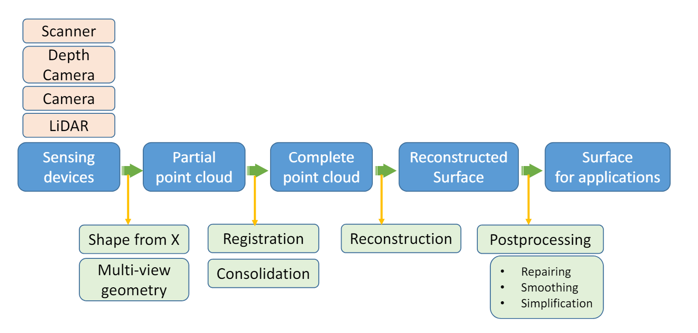

# 曲面重建
## 曲面重建的步骤

1. 数据获取（Acquisition）：体积扫描（Volume Scanning）、SFS（Shape from Shading）、IBM（Image based modeling）、结构光（Structured Light）、SLAM（Simultaneous Localization and Mapping）、激光雷达测距（Laser Radar）、深度图（Depth Images）、Shape from contour、探针（Probing）、全景相机（Panorama）
2. 注册（Registration）：即将数据获得阶段获得的数据进行拼接。
3. 巩固（consolidation）：填补在数据获取阶段没能获得的一些曲面信息。
4. 重建（Reconstruction）
5. 后处理（Post-processing）：包含去噪、修复、光顺、简化……